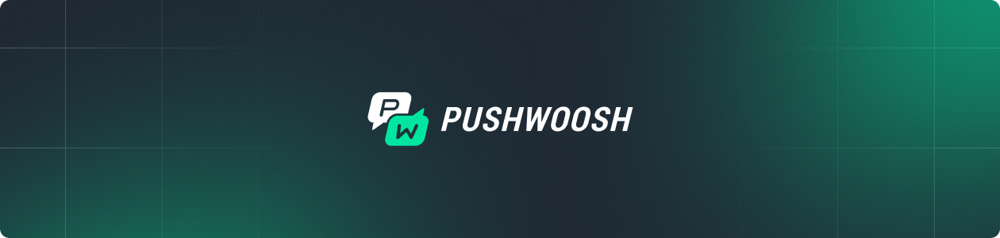

<p align="center">
  <a href="https://docs.pushwoosh.com/developer/pushwoosh-sdk/cross-platform-frameworks/cordova/">
    
  </a>
</p>

<h1 align="center">Pushwoosh OutSystems Plugin</h1>

<p align="center">
  <a href="https://github.com/Pushwoosh/pushwoosh-outsystems-plugin/releases"></a>
  <a href="https://github.com/Pushwoosh/pushwoosh-outsystems-plugin/blob/main/LICENSE.md"></a>
</p>

<p align="center">
  Push notifications, In-App messaging, and more for OutSystems mobile applications.
</p>

<p align="center">
  Built from <a href="https://github.com/Pushwoosh/pushwoosh-phonegap-plugin">Pushwoosh Cordova Plugin</a> 8.3.74.
</p>

## Table of Contents

- [Documentation](#documentation)
- [Features](#features)
- [Installation](#installation)
- [Firebase Configuration](#firebase-configuration)
- [Quick Start](#quick-start)
- [API Reference](#api-reference)
- [Plugin Preferences](#plugin-preferences)
- [Differences from the Cordova Plugin](#differences-from-the-cordova-plugin)
- [Contributing](#contributing)
- [Support](#support)
- [License](#license)

## Documentation

- [Integration Guide](https://docs.pushwoosh.com/platform-docs/pushwoosh-sdk/cross-platform-frameworks/cordova/integrating-cordova-plugin) — step-by-step setup
- [API Reference](https://docs.pushwoosh.com/platform-docs/pushwoosh-sdk/cross-platform-frameworks/cordova/cordova-plugin-api-reference) — full API documentation

## Features

- **Push Notifications** — register, receive, and handle push notifications on iOS and Android
- **In-App Messages** — trigger and display in-app messages based on events
- **Tags & Segmentation** — set and get user tags for targeted messaging
- **User Identification** — associate devices with user IDs for cross-device tracking
- **Message Inbox** — built-in UI for message inbox with customization options
- **Badge Management** — set, get, and increment app icon badge numbers
- **Local Notifications** — schedule and manage local notifications
- **Huawei Push** — HMS push notification support

## Installation

Add the plugin in your module's **Extensibility Configurations**:

```json
{
  "plugin": {
    "url": "https://github.com/Pushwoosh/pushwoosh-outsystems-plugin.git#8.3.74-OS.1",
    "variables": [
      { "name": "LOG_LEVEL", "value": "DEBUG" }
    ]
  }
}
```

Then generate a new mobile build in Service Studio.

> **Always pin a tag, never a branch.** MABS caches plugins by the URL it was
> given, so a reference it has already fetched is never fetched again. A moving
> branch reaches no device after the first build.

## Firebase Configuration

Android push requires the Firebase configuration from your own project. The
plugin does not ship one.

1. Download `google-services.json` from the Firebase console.
2. Compress it into `google-services.zip`.
3. Upload the archive as a resource in your OutSystems module, with **Deploy Action** set to *Deploy to Target Directory*.

The build stops if the archive is missing — an application without an FCM
configuration receives nothing.

For Huawei devices, do the same with `agconnect-services.json` compressed into
`agconnect-services.zip`. Huawei support is skipped when the archive is absent.

## Quick Start

### Initialization

Call `onDeviceReady` from a JavaScript node and wait for its callback before
anything else. Every other method is safe to call once it has fired.

```javascript
var pushwoosh = cordova.require("pushwoosh-cordova-plugin.PushNotification");

// 1. Register notification callbacks before initialization
document.addEventListener('push-receive', function(event) {
    var notification = event.notification;
    console.log("Push received: " + JSON.stringify(notification));
});

document.addEventListener('push-notification', function(event) {
    var notification = event.notification;
    console.log("Push opened: " + JSON.stringify(notification));
});

// 2. Initialize Pushwoosh
pushwoosh.onDeviceReady(
    function() {
        // 3. Register the device to receive push notifications
        pushwoosh.registerDevice(
            function(status) { $resolve(status.pushToken); },
            function(error) { $reject(error); }
        );
    },
    function(error) { $reject(error); },
    { appid: "XXXXX-XXXXX" }              // Pushwoosh Application ID
);
```

### User ID and Events

```javascript
var pushwoosh = cordova.require("pushwoosh-cordova-plugin.PushNotification");

pushwoosh.setUserId($parameters.UserId);

pushwoosh.postEvent("purchase", {
    product: "Premium Plan",
    price: "9.99"
});
```

### Tags

```javascript
var pushwoosh = cordova.require("pushwoosh-cordova-plugin.PushNotification");

pushwoosh.setTags(
    { age: 25, name: "John", favorite_categories: ["sports", "news"] },
    function() { $resolve(); },
    function(error) { $reject(error); }
);

pushwoosh.getTags(
    function(tags) { $resolve(JSON.stringify(tags)); },
    function(error) { $reject(error); }
);
```

## API Reference

### Initialization & Registration

| Method | Description |
|--------|-------------|
| `onDeviceReady(success, fail, config)` | Initialize the plugin. Call on every app launch |
| `registerDevice(success, fail)` | Register for push notifications |
| `unregisterDevice(success, fail)` | Unregister from push notifications |
| `getPushToken(success)` | Get the push token |
| `getPushwooshHWID(success)` | Get Pushwoosh Hardware ID |

### Tags & User Data

| Method | Description |
|--------|-------------|
| `setTags(tags, success, fail)` | Set device tags |
| `getTags(success, fail)` | Get device tags |
| `setUserId(userId)` | Set user identifier for cross-device tracking |
| `setLanguage(language)` | Set custom language for localized pushes |
| `setEmail(email, success, fail)` | Register email for the user |
| `setEmails(emails, success, fail)` | Register multiple emails |

### Notifications

| Method | Description |
|--------|-------------|
| `getRemoteNotificationStatus(success, fail)` | Get push notification permission status |
| `getLaunchNotification(success)` | Get notification that launched the app |
| `createLocalNotification(config, success, fail)` | Schedule a local notification |
| `clearLocalNotification()` | Clear all pending local notifications (Android) |
| `clearNotificationCenter()` | Clear all notifications from notification center (Android) |

### Badge Management

| Method | Description |
|--------|-------------|
| `setApplicationIconBadgeNumber(badge)` | Set badge number |
| `getApplicationIconBadgeNumber(success)` | Get current badge number |
| `addToApplicationIconBadgeNumber(badge)` | Increment/decrement badge |

### In-App Messages & Events

| Method | Description |
|--------|-------------|
| `postEvent(event, attributes)` | Post event to trigger In-App Messages |
| `addJavaScriptInterface(name)` | Add JS interface for Rich Media communication |

### Message Inbox

| Method | Description |
|--------|-------------|
| `presentInboxUI(params)` | Open inbox UI with optional style customization |
| `loadMessages(success, fail)` | Load inbox messages programmatically |
| `unreadMessagesCount(success)` | Get unread message count |
| `messagesCount(success)` | Get total message count |
| `readMessage(id)` | Mark message as read |
| `deleteMessage(id)` | Delete a message |
| `performAction(id)` | Perform the action associated with a message |

### Diagnostics

| Method | Description |
|--------|-------------|
| `getDiagnostics(success, fail)` | Returns a JSON string describing the integration state: effective and built-in Application Code, API token presence, HWID, push token, notification permission, services registered for messaging events, plugin and native SDK versions. Attach it to support tickets instead of collecting device logs |

### Communication Control

| Method | Description |
|--------|-------------|
| `setCommunicationEnabled(enable, success, fail)` | Enable/disable all Pushwoosh communication |
| `isCommunicationEnabled(success)` | Check if communication is enabled |

### Events

| Event | Description |
|-------|-------------|
| `push-receive` | Fired when a notification is received while the app is active |
| `push-notification` | Fired when a notification is opened by the user |

## Plugin Preferences

Set these under `variables` in the Extensibility Configurations:

```json
{
  "plugin": {
    "url": "https://github.com/Pushwoosh/pushwoosh-outsystems-plugin.git#8.3.74-OS.1",
    "variables": [
      { "name": "PW_APPID", "value": "XXXXX-XXXXX" },
      { "name": "PW_API_TOKEN", "value": "your device API token" },
      { "name": "LOG_LEVEL", "value": "DEBUG" },
      { "name": "ANDROID_FOREGROUND_PUSH", "value": "false" },
      { "name": "PREHANDLE_URL_NOTIFICATIONS", "value": "NO" }
    ]
  }
}
```

| Preference | Default | Description |
|-----------|---------|-------------|
| `PW_APPID` | *(empty)* | Pushwoosh Application Code, written into AndroidManifest.xml and Info.plist at build time. With it the SDK is configured even before JavaScript runs — pushes delivered to a killed app are handled and open statistics are collected |
| `PW_API_TOKEN` | *(empty)* | Pushwoosh Device API token, written into the native build the same way |
| `LOG_LEVEL` | `DEBUG` | Logging level |
| `IOS_FOREGROUND_ALERT_TYPE` | `ALERT` | iOS foreground notification display type |
| `ANDROID_FOREGROUND_PUSH` | `false` | Show notifications when app is in foreground (Android) |
| `PREHANDLE_URL_NOTIFICATIONS` | `NO` | Let the SDK open notification URLs before the app sees them |

Variable names are **case-sensitive** — write them exactly as shown.
Initializing from JavaScript (`onDeviceReady` with `appid`) keeps working and
still applies when both are set.

### Setting the Application Code from a consumer app

Plugin variables only work in the Extensibility Configurations of the module
that declares the plugin — OutSystems does not merge variables from a consumer
app into a producer's plugin entry. If the plugin comes into your app through
a module (the usual Forge setup), set `PW_APPID` / `PW_API_TOKEN` as
application **preferences** instead — the plugin reads them at build time and
writes the same native entries:

```json
{
  "preferences": {
    "global": [
      { "name": "PW_APPID", "value": "XXXXX-XXXXX" }
    ]
  }
}
```

A preference wins over a plugin variable when both are set.

## Differences from the Cordova Plugin

| | Cordova | OutSystems |
|---|---|---|
| `onDeviceReady` | `onDeviceReady(config)` | `onDeviceReady(success, fail, config)` — a client action has to know when initialization finished |
| Firebase config | `google-services.json` in the project | `google-services.zip` uploaded as a module resource, unpacked at build time |
| Foreground push on Android | shown by default | hidden by default; the application decides how to present it |
| URL notifications | opened by the SDK | left to the application |
| Firebase messaging service | declared by the plugin | left to MABS, which installs its own router |

## Contributing

**This repository is generated.** Every file here is produced by applying the
OutSystems layer to an upstream Cordova plugin release, so changes committed
here are overwritten by the next build.

Report issues and send changes to the
[Pushwoosh Cordova Plugin](https://github.com/Pushwoosh/pushwoosh-phonegap-plugin/issues)
or to Pushwoosh support.

## Support

- [Documentation](https://docs.pushwoosh.com/)
- [Support Portal](https://support.pushwoosh.com/)

## License

Pushwoosh OutSystems Plugin is available under the MIT license. See [LICENSE](LICENSE.md) for details.

---

Made with ❤️ by [Pushwoosh](https://www.pushwoosh.com/)
